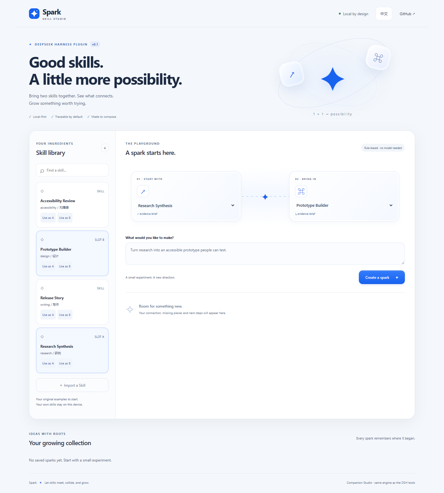
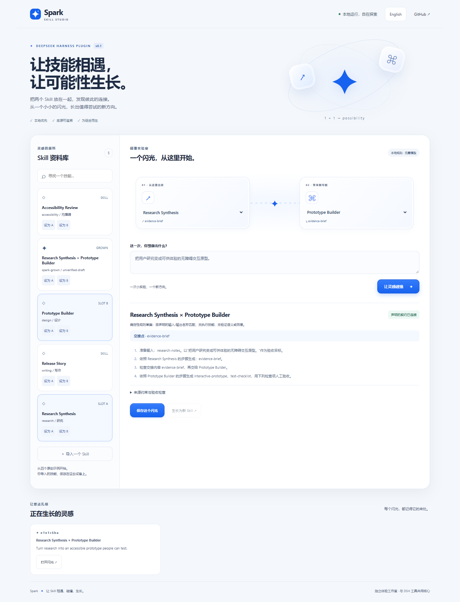
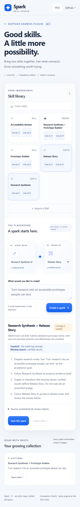

<p align="center"></p>
<h1 align="center">Spark · Let skills grow.</h1>
<p align="center">A local-first skill composition plugin for DeepSeek Harness.<br>Bring two skills together. Keep the evidence. Grow a new starting point.</p>
<p align="center"><a href="README.zh-CN.md">简体中文</a> · <a href="#quick-start">Quick start</a> · <a href="docs/TESTING.md">Test evidence</a> · <a href="docs/ARCHITECTURE.md">Architecture</a></p>



**Two skills are more useful when their connection is explicit.** Spark finds declared handoffs, shows what is missing, keeps both sets of constraints, and turns a saved composition into a new Skill draft that can participate in the next collision.

> v0.1.0 is a **deterministic composition workbench**, not an autonomous skill executor or an AI discovery benchmark. A matching label is a lead to investigate, not proof of compatibility. Studio is a standalone companion UI using the same engine as the DSH tools; the screenshot is not an embedded DSH panel.

## What makes a spark?

- **Compose, then grow.** Research Synthesis → Prototype Builder produces a draft; that draft can meet Accessibility Review in a second generation.
- **Keep the roots.** Every collision stores source snapshots, an engine version, a content fingerprint, constraints and parent IDs.
- **Make gaps useful.** Missing downstream inputs become explicit bridge requirements, not invented success scores.
- **Own your workspace.** SQLite on your device, no telemetry, no external fonts, no runtime CDN and no model key required for Spark's engine or Studio.
- **Use it your way.** Six native DSH tools, a bilingual Studio, and `SKILL.md` export. A quiet, cancellable collision animation respects reduced motion; there is no navigation sound.

## Quick start

Prerequisites: **Node.js 22.19+** with `node:sqlite` available (Node 24 recommended), npm, Git. Initial dependency installation needs network access; installed Spark runs locally. Older Node 22 builds may print an experimental SQLite warning.

```sh
git clone https://github.com/KratosLee-6/dsh-plugin-spark.git
cd dsh-plugin-spark
npm ci
npm run build
npm run studio
```

Open **http://127.0.0.1:4317**. Select Research Synthesis and Prototype Builder, describe a goal, then **Create a spark → Save this spark → Grow a Skill → Export SKILL.md**. Select the grown Skill as A and Accessibility Review as B to continue growing.

Four original, synthetic examples are included. Import your own structured JSON from [the example contract](examples/skill.json). Existing IDs are immutable: identical imports are idempotent; changed content needs a new ID. Arbitrary Markdown/SKILL.md import is not supported in this release.

### Load into DeepSeek Harness

Compatibility target: **`@deepseek-ai/dsh@0.1.5-rc.2`**, **`@deepseek-ai/dsh-tools@0.1.5-rc.2`**, **`@deepseek-ai/cordis@4.0.2`**. Harness is a developer preview; pin versions and retest upgrades. This repository is an independent community plugin, not an official DeepSeek product.

From this cloned and built repository:

```sh
node dist/cli.js patch --output spark.patch.yml --data-dir .spark
npx --no-install dsh web --patch spark.patch.yml
```

The helper writes an absolute plugin path and absolute database directory for your machine. It refuses to overwrite an existing patch. Move the checkout? Generate a fresh patch. **Do not commit your generated patch**: it contains local paths. The development dependencies include the pinned DSH CLI so the command does not silently download a different version.

To use a separate DSH installation, pass the generated patch's absolute path to that installation's `dsh web --patch` command. The exact host runtime must satisfy the pinned peers. This release uses the documented local patch-loading route; one-click plugin-manager installation and npm publication are not claimed.

Try this prompt in your configured DSH session:

> Use spark_search to find research and prototype skills. Inspect both, then use spark_collide to draft a plan for an accessible prototype. Show missing inputs and constraints. Do not save until I ask.

**Offline boundary:** Spark tools perform local operations. DSH's conversational agent still needs a configured model. If you use a cloud model, Skill content returned to that agent can be sent to the provider. Fully offline agent use needs a separately configured compatible local model; that model path is not validated here.

## Tool surface

| Tool | Behavior | Writes? |
| --- | --- | --- |
| `spark_search` | Search names, descriptions, tags and declared contracts | No |
| `spark_inspect` | Read a Skill, constraints and lineage | No |
| `spark_import` | Validate and import one structured Skill JSON | Yes, on request |
| `spark_collide` | Compose A → B; report handoffs, gaps, plans and checks | Only with `save: true` |
| `spark_grow` | Grow a saved collision into a reusable draft; return SKILL.md | Yes, on request |
| `spark_history` | Read up to 100 saved collisions with source snapshots | No |

Language argument: `en` (default) or `zh`. Names match after Unicode NFKC normalization, trimming and case normalization. The engine does **not** infer synonyms, parse actual output formats, resolve constraint conflicts or execute Skill instructions. User goals guide the human-readable draft and its identity, not an AI planner.

## See the connection



<details><summary>Mobile-width Studio screenshot</summary>



</details>

The mobile layout is browser-tested at 390 px. This is **not** an iOS or Android native package or a phone-resident DSH runtime.

## Data and trust

`--data-dir` / plugin `dataDir` controls the local SQLite directory (default `.spark` relative to the launching process). Studio and DSH can share the same directory; SQLite serializes committed writes and duplicate saves are idempotent. Use a local disk, not a network-mounted database. Stop both processes before copying `spark.db` for a backup; restore into an empty directory with both stopped. The database is not encrypted.

Studio binds only to `127.0.0.1`, validates Host/Origin and uses a per-process write token. It serves an explicit asset allowlist with a restrictive CSP. This reduces browser-origin attacks; it is not a sandbox against other processes running as your user. Do not expose its port publicly.

Imported instructions are untrusted data. Spark never executes them, installs generated drafts, uploads files or scans your directories. A human must review a grown Skill before installing or using it elsewhere. Public examples and screenshots contain no customer records.

## Develop and verify

```sh
npm ci
npm run check
npx playwright install chromium
npm run test:ui
npm pack
```

On a Windows machine with Edge already installed, browser tests can use:

```powershell
$env:SPARK_BROWSER_CHANNEL = 'msedge'
npm run test:ui
```

See [test scope and evidence](docs/TESTING.md) for measured coverage, environments and what remains untested. Coverage is a regression signal, not a perfection claim. CI exercises the core on Windows/Linux and browser flows on Linux. The npm archive allowlist excludes databases, tests, screenshots and local settings.

## Help the next spark grow

Useful feedback includes a **synthetic pair of Skill contracts**, the expected handoff, what Spark reported, the host/Node version and steps to reproduce. Please avoid API keys, personal records and proprietary Skill content. See [contributing](CONTRIBUTING.md) and [security](SECURITY.md).

Next candidates: reviewed Markdown import, explicit typed contract adapters, portable workspace backup/restore, optional model-assisted suggestions with evidence, and a native DSH result renderer. These are proposals, not shipped features.

[Delivery roadmap and acceptance gates](docs/ROADMAP.md).

MIT licensed. Original Spark code and artwork © 2026 KratosLee-6. Runtime peer packages retain their own licenses. [Third-party notices](THIRD_PARTY_NOTICES.md).
