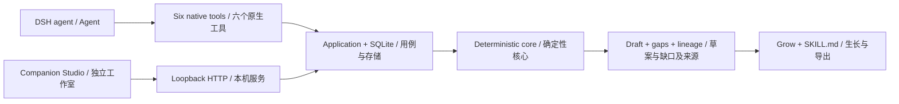

# Architecture / 技术架构

Spark has one composition engine and two entry points. / 一个组合核心，两个入口。

## Contracts / 数据契约

`Skill` declares `id`, `name`, `description`, `inputs`, `outputs`, `steps`, `constraints`, `tags`, and `parents` (optional on import). IDs use lowercase ASCII letters, digits and hyphens, max 80 characters. Arrays contain at most 32 nonempty strings of at most 500 characters; inputs, outputs and steps cannot be empty. Imported JSON is limited to 64 KB. Names are limited to 120 characters, descriptions to 2,000, goals to 1,000. Validation runs at runtime, not just in TypeScript.

`Skill` 声明编号、名称、描述、输入、输出、步骤、约束、标签及父级。导入可省略父级。编号仅允许小写英文字母、数字、连字符，最长 80 字符；数组最多 32 项，每项最长 500 字符；输入、输出、步骤不能为空。JSON 最多 64 KB；名称 120 字符，描述 2,000 字符，目标 1,000 字符。运行时会校验数据，不依赖静态类型兜底。

Composition is directional: A's outputs are normalized and matched to B's required inputs. A result is `connected` only when every B input matches; otherwise it is `bridge-needed`. These labels refer only to declarations, not executable interoperability. No network, model, shell or Skill execution occurs inside the engine.

组合有方向：A 的输出经过规范化，与 B 的必需输入匹配。只有所有输入都匹配才标为 `connected`，否则为 `bridge-needed`。状态仅描述声明层面的匹配，不代表实际可执行兼容性。引擎不请求网络、不调用模型或 shell，也不执行 Skill。

## Persistence and growth / 持久化与生长

Collision identity includes ordered source snapshots, goal, language and engine version. The full SHA-256 fingerprint is retained; a 24-hex prefix forms the public ID. Repeating a save returns `created: false`. Skill IDs never silently overwrite existing content. SQLite statements commit atomically, use prepared parameters, and wait up to 3 seconds for competing writes. Schema version 1 rejects newer schemas. The latest 100 collisions are returned by history; stored rows are not automatically deleted.

碰撞身份包含有序来源快照、目标、语言和引擎版本。完整 SHA-256 指纹保留，24 位十六进制前缀用于公开编号。重复保存返回 `created: false`；Skill 不会静默覆盖。SQLite 使用参数化语句和原子提交，竞争写入最多等待 3 秒。当前 schema 版本为 1，拒绝打开更高版本库。历史接口返回最近 100 项，但不会自动删除旧数据。

Growth is explicit and requires a saved parent collision. It unions A's required inputs with missing B inputs, retains B's outputs and both sets of constraints, and labels the result `unverified-draft`. It creates a new ID and retains direct parent Skill IDs. A grown Skill is reusable as an input to later collisions. This is structured draft composition, not measured learning or autonomous self-improvement.

生长是显式操作，要求先保存碰撞。新草案合并 A 的输入和 B 的待补输入，保留 B 的输出及双方约束，标记为 `unverified-draft`，生成新 ID 并保存直接父级编号。它能继续参与碰撞，但这不等于模型学习或自主进化。

## Lifecycle and presentation / 生命周期与呈现

Cordis owns tool registration and the SQLite disposer; unload removes tools and closes storage. Every tool checks the host cancellation signal before work. The engine and writes are synchronous and small; cancellation after a completed commit cannot undo it. No timers or background agents are created by the plugin.

Cordis 管理工具注册和数据库释放。卸载会移除工具并关闭连接；工具执行前检查宿主取消信号。核心计算和写入是短同步操作，提交完成后的取消不会撤销已提交数据。插件不创建定时任务或后台 Agent。

Studio owns its finite 820 ms animation, cancels on input/language changes or page hiding, and skips the wait when reduced motion is active. Business data comes from the server; the animation never commits data. Controls prevent duplicate requests, and database IDs provide a second layer of idempotency. Studio has no audio runtime.

Studio 管理有限的 820ms 动画，在输入/语言变化或页面隐藏时取消；减少动态效果时不等待动画。业务结果来自服务端，动画不负责提交。按钮防止重复请求，数据库标识提供第二层幂等保障。工作室没有音频运行时。

## Integration boundary / 集成边界

The shipped adapter is a native DSH tool plugin, not an MCP server. A local patch loads the built `dist/index.js`. Studio is a separate loopback interface; it is not a registered DSH client-side panel. Adding an MCP adapter or host-native renderer later should reuse the same core rather than fork business logic.

交付适配器是 DSH 原生工具插件，不是 MCP 服务。通过本地 patch 加载 `dist/index.js`。Studio 是独立的本机界面，未注册为 DSH 客户端面板。未来如加入 MCP 或宿主原生渲染，应复用核心，避免复制业务逻辑。
